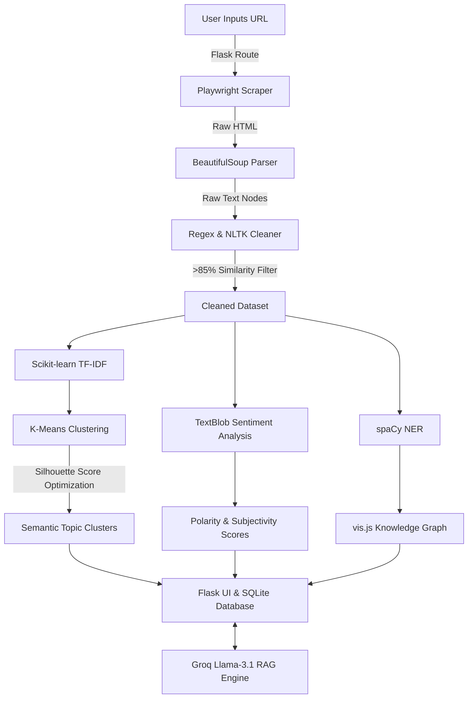

# GistProbe: Real-Time Unsupervised Web NLP Analyzer

> **🎥 Watch the 1-Minute Video Demo Here: [Insert YouTube/Loom Link Here]**

**Built by Ojaswi Gupta** | **Domain:** Natural Language Processing (NLP) & Unsupervised Machine Learning

An end-to-end Machine Learning web application that dynamically crawls any URL, analyzes text using unsupervised machine learning, and surfaces semantic clusters, sentiment scores, and extractive summaries through an interactive web dashboard.

---

## 🌟 Why This Project Stands Out

GistProbe is not a standard wrapper around an API. It is a full-fledged NLP pipeline that builds custom datasets in real-time and applies mathematical heuristics to understand text:

- **Dynamic Dataset Generation:** Uses **Playwright** and **BeautifulSoup** to scrape the DOM dynamically, bypassing basic blocks.
- **Unsupervised Optimization:** Instead of hardcoding K-Means clusters, it dynamically evaluates **k = 2 to 10** and selects the value with the highest **Silhouette Score** for the specific webpage.
- **Intelligent Deduplication:** Uses `SequenceMatcher` to compute string similarity ratios, filtering out paragraphs with >85% overlap to ensure cluster quality.
- **Generative AI Chat (RAG):** Integrates **Llama-3.1 (via Groq API)** to allow users to chat directly with the scraped contents of any webpage or compare two URLs side-by-side.

---

## ⚙️ System Architecture & Data Flow



### 5-Stage ML Pipeline

| Stage | Component | What Happens |
|---|---|---|
| **1. Crawl** | Playwright & BeautifulSoup | Scrapes the DOM with rotating user-agents & extracts raw text nodes. |
| **2. Clean & Deduplicate** | Python (Regex) & NLTK | Removes non-alphanumeric noise, normalizes text, and removes near-duplicates (>85% similarity). |
| **3. Sentiment Analysis**| TextBlob | Computes sentiment polarity & subjectivity scoring for every extracted sentence. |
| **4. Cluster** | scikit-learn (TF-IDF & K-Means) | Vectorizes text, computes optimal `k` via Silhouette Score, and assigns sentences to semantic clusters. |
| **5. Entity Extraction** | spaCy (en_core_web_sm) | Performs Named Entity Recognition (NER) to map People, Organizations, and Locations. |

---

## 💾 Database Schema

GistProbe uses **SQLAlchemy** with an SQLite database to cache NLP results, reducing redundant compute load for previously analyzed URLs.

**1. `User` Table** (OAuth handled via Authlib Google Login)
- `id` (Integer, Primary Key)
- `email` (String)
- `name` (String)

**2. `ProbeResult` Table** (Caches expensive ML outputs)
- `id` (Integer, Primary Key)
- `user_id` (Foreign Key -> User.id)
- `url` (String)
- `timestamp` (DateTime)
- `total_items` (Integer)
- `avg_subjectivity` (Float)
- `results_json` (Text) — *Stores JSON blobs of K-Means cluster arrays, SpaCy entity graphs, and TF-IDF metrics for instant "Demo Mode" loading.*

---

## 🛠️ Tech Stack

**Machine Learning & NLP:**
- `scikit-learn` — TF-IDF Vectorizer, K-Means Clustering, Silhouette Score
- `spaCy` — Named Entity Recognition (NER)
- `NLTK` — Text tokenization & stop words
- `TextBlob` — Sentiment polarity & subjectivity scoring
- `Pandas` & `NumPy` — Data manipulation & mathematical operations
- `Groq API (Llama-3.1)` — Conversational RAG agent and media debate analysis

**Backend & Web Scraping:**
- `Python 3.11` & `Flask` — Web framework & orchestration
- `Playwright` & `BeautifulSoup4` — Dynamic web crawling
- `SQLAlchemy` — ORM for Database management

**Frontend:**
- `Bootstrap 5` — Responsive layout
- `vis.js` — Interactive physics-based network graphs (Knowledge Graph)
- `Chart.js` — Interactive donut charts (Sentiment & Topic Distribution)

---

## 🚀 Advanced Features

### 🕸️ Interactive Entity Knowledge Graph
Entities (People, Organizations, Locations) extracted via **spaCy** are mapped into an interactive network graph using **vis.js**. The physics engine groups entities based on sentence co-occurrences. Clicking an entity node instantly filters the raw data tables.

### 🤖 Chat with Website & Fact Check Mode
Chat directly with the scraped contents using **Llama-3**. Enable **Fact Check Mode** to force the AI to cross-reference claims in the article against real-world knowledge, highlighting biases and inaccuracies.

### ⚖️ Multi-URL Debate Mode
Compare two URLs side-by-side. The AI acts as an Expert Media Analyst, reading both articles and generating an **Executive Comparison Summary** that highlights differences in tone, framing, biases, and factual omissions between the sources.

---

## 📂 Project Structure

```text
GistProbe/
├── app.py              # Flask routes, pipeline orchestration & DB Models
├── crawler.py          # Playwright & BS4 Web Scraper
├── analyser.py         # Text cleaning, NLTK deduplication & TextBlob sentiment
├── clustering.py       # Scikit-learn TF-IDF, K-Means & Silhouette optimization
├── ner.py              # spaCy Named Entity Recognition engine
├── wordcloud_gen.py    # TF-IDF visual representation logic
├── tests.py            # Unit tests for the core ML pipeline
├── templates/          # Jinja2 HTML Dashboard Views
└── requirements.txt    # Strict environment dependencies
```

---

## ⚙️ Local Setup (Run it yourself!)

Follow these exact steps to run the complete NLP pipeline on your local machine:

**1. Clone the repository**
```bash
git clone https://github.com/Ojaswi-Gupta/GistProbe.git
cd GistProbe
```

**2. Create & activate a virtual environment**
```bash
# Mac/Linux:
python3 -m venv venv
source venv/bin/activate

# Windows:
python -m venv venv
venv\Scripts\activate
```

**3. Install dependencies**
```bash
pip install -r requirements.txt
```

**4. Download ML Models & Browser Binaries (First run only)**
```bash
playwright install chromium
python -m spacy download en_core_web_sm
python -c "import nltk; nltk.download('punkt'); nltk.download('stopwords')"
```

**5. Set up Environment Variables**
Create a `.env` file in the root directory and add your API keys. You can get a free API key from the [Groq Console](https://console.groq.com/).
```env
GROQ_API_KEY="your-groq-api-key-here"
FLASK_SECRET_KEY="any-random-string"
# Google OAuth (Optional, only needed if you want to test the login feature)
GOOGLE_CLIENT_ID="optional"
GOOGLE_CLIENT_SECRET="optional"
```

**6. Start the Server**
```bash
python app.py
```

**7. Access the App**
Open your browser and navigate to: **http://127.0.0.1:5000**

---

## 📝 Resume Bullet Example

> *"Built GistProbe, a full-stack NLP web application that dynamically scrapes and semantically clusters web content using K-Means + TF-IDF, featuring a spaCy Interactive Knowledge Graph and Llama-3 integration for real-time web chat, fact-checking, and multi-URL media debate analysis."*

---

**License:** Created by Ojaswi Gupta. All rights reserved.
